# Documentação de testes

- **Visão geral**

A Lacrei Saúde é uma plataforma que conecta profissionais da saúde e a comunidade LGBTQIAPN+ .

- **Objetivo**

Garantir a qualidade dos principais fluxos da plataforma Lacrei Saúde, validando aspectos funcionais, de acessibilidade, desempenho, responsividade e automação.

- **Ambiente utilizado**
    - Aplicação acessada via desktop e mobile
    - URL do sistema: [https://paciente-staging.lacreisaude.com.br/](https://paciente-staging.lacreisaude.com.br/)
    - Navegador utilizado: Google Chrome
    - Sistema operacional: macOS/Iphone12 Pro

Não foi necessária nenhuma configuração adicional para execução dos testes.

- **Tipos de testes realizados**
    - Testes funcionais
    - Testes de acessibilidade
    - Teste de performance
    - Teste de responsividade
- **Como executar os testes**
1. Abrir o navegador Google Chrome
2. Acessar o link da aplicação de testes
3. Realizar cadastro ou login na plataforma
4. Executar os cenários de teste descritos nesse documento

**Checklist de segurança aplicado**

Durante a execução dos testes foram observados alguns pontos básicos de segurança, como:

- validação de campos obrigatórios
- validação de formato de e-mail
- verificação de acesso a funcionalidades apenas após login

Não foram realizados testes de segurança aprofundados.

**Link Projeto de automação cypress**

[https://github.com/jennifercvalle/lacrei-saude-cypress](https://github.com/jennifercvalle/lacrei-saude-cypress)

---

### **Registro de Testes Funcionais (Versão Mobile)**

- Cadastro de usuário
- Ativação de conta
- Completar cadastro
- Buscar profissionais
- Contatar profissionais
- Recuperação de senha

| Funcionalidade | Cadastro de usuário |
| --- | --- |
| Cenário | Cadastro de usuário com dados válidos |
| Dado | Que o usuário está na página de cadastro |
| Quando | Ele preenche todos os campos obrigatórios com dados válidos |
| E | Envia o formulário de cadastro |
| Então | O sistema deve enviar email com link de confirmação para o email cadastrado |
| Resultado obtido | Cadastro realizado com sucesso e e-mail de confirmação enviado para o endereço cadastrado. |
| Status | Passou |

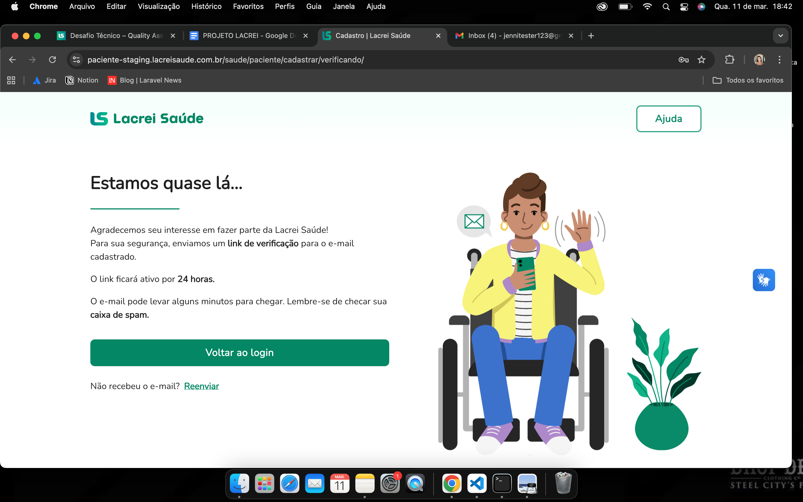

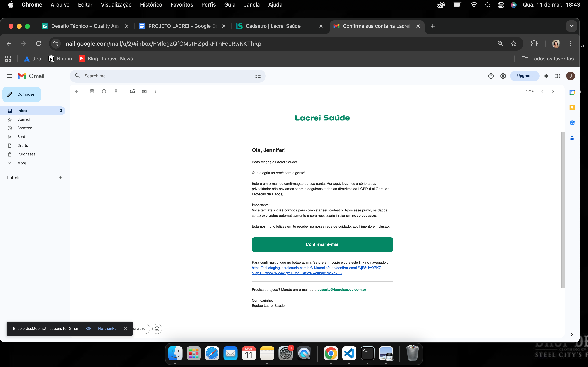

| Funcionalidade | Ativação da conta |
| --- | --- |
| Cenário | Usuário ativa a conta pelo email |
| Dado | Que o usuário recebeu o email com o link de ativação |
| Quando | Ele clicar em “Confirmar email” |
| Então | Então a conta deve ser ativada |
| E | O sistema deve redirecionar para a página de login |
| Resultado obtido | Email ativado com sucesso e redirecionamento para página de login. |
| Status | Passou |

| Funcionalidade | Completar cadastro |
| --- | --- |
| Cenário | Usuário completa cadastro após a ativação |
| Dado | Que o usuário ativou sua conta através do email |
| E | Efetuou o login e senha |
| E | É redirecionado para a página onde deve completar o cadastro |
| Quando | Ele responder as questões e finalizar o cadastro |
| Então | O cadastro é concluído com sucesso |
| Resultado obtido | Ao responder o questionário o cadastro é concluído com sucesso. |
| Status | Passou |

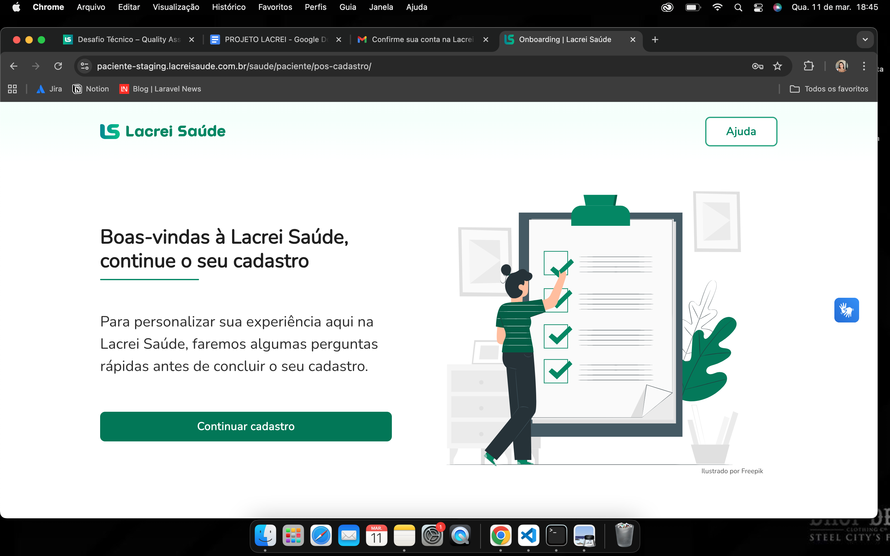

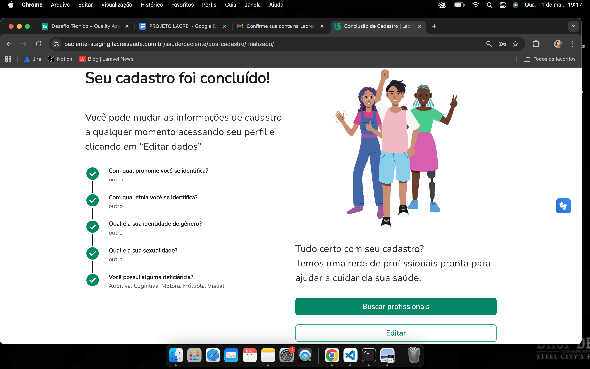

| Funcionalidade | Buscar profissionais |
| --- | --- |
| Cenário | Usuário busca por profissional da saúde |
| Dado | Que o usuário está logado na plataforma |
| Quando | Ele acessa a área de busca |
| E | Informa um critério de pesquisa |
| Então | O sistema deve mostrar os profissionais correspondente |
| Resultado obtido | O sistema apresenta os profissionais disponíveis |
| Status | Passou |

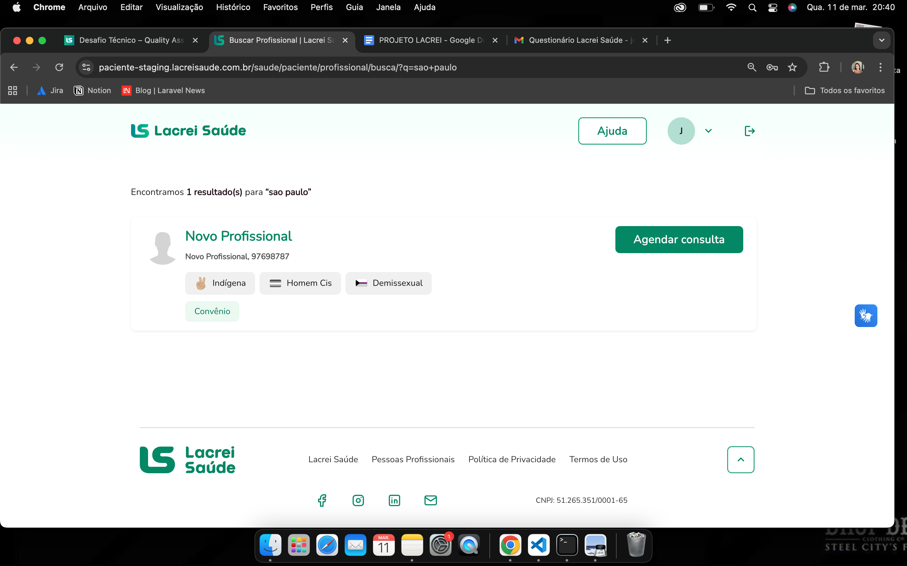

| Funcionalidade | Contatar profissional da saúde |
| --- | --- |
| Cenário | Usuário busca e contata um profissional da saúde |
| Dado | Que o usuário está logado na plataforma |
| Quando | Ele acessa a busca de profissionais |
| E | Informa eu critério de busca |
| E | Clica em "buscar” |
| Então | O sistema deve exibir uma lista de profissionais |
| E | O usuário deve poder selecionar um profissional |
| E | Clicar em agendar consulta |
| E | Contatar o profissional com sucesso |
| Resultado obtido | Ao clicar na opção “Agendar consulta”, nenhuma ação acontece, impedindo que o usuário contate o profissional. |
| Status | Reprovou - Bug reportado BR04 |
|  | 🔗 🎥 [LINK DE EVIDENCIA DO BUG REPORTADO EM VIDEO](https://www.loom.com/share/1675e82433174e37bd9f30982b5b1832) |

| Funcionalidade | Recuperação de senha |
| --- | --- |
| Cenário | Usuário recupera a senha utilizando o “Esqueci minha senha” |
| Dado | Que o usuário está na página de login |
| E | Esqueceu a senha |
| Quando | Ele clica em "Esqueci minha senha” |
| E | Informa o email cadastrado |
| E | Solicita a recuperação de senha |
| Então | O sistema deve enviar um email com as instruções para recuperação de senha |
| Quando | O usuário acessar o link enviado no email |
| E | Cadastrar uma nova senha válida |
| Então | O sistema deve permitir que o usuário faça o login com nova senha |
| Resultado obtido | Ao clicar na opção “Esqueci minha senha”, o sistema atualiza a página e impede que o usuário digite o e-mail para recuperação. |
| Status | Reprovou - Bug reportado BR03 |
|  | 🔗 🎥  [LINK DE EVIDENCIA DO BUG REPORTADO EM VIDEO](https://www.loom.com/share/7d76bd533f874affa0bc76f67fc7b0e7)  |
|  |  |

| Funcionalidade | Login - Validação de email |
| --- | --- |
| Cenário | Login com email em formato inválido |
| Dado | Que o usuário esteja na tela de login |
| Quando | Ele insira um email em formato inválido |
| E | Clicar em “Entrar” |
| Então | O sistema deve exibir mensagem de erro informando formato inválido de e-mail |
| Resultado obtido | O sistema apresenta a mensagem de erro |
| Status | Passou |
| Variações testadas: | Email sem “@”: [emailteste.com](http://emailteste.com/)
Email sem domínio: email@Email 
sem “.com” → email@testeEmail 
com espaço: email @teste.com
Apenas números: 123456 |

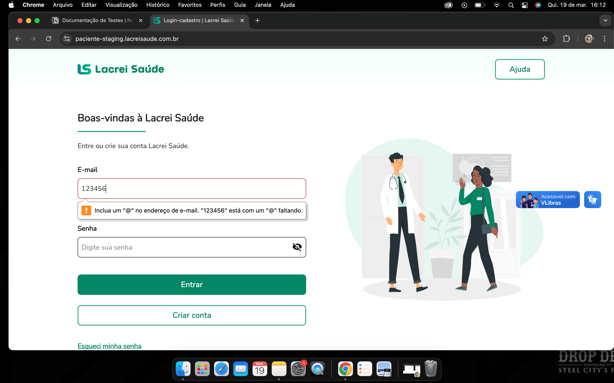

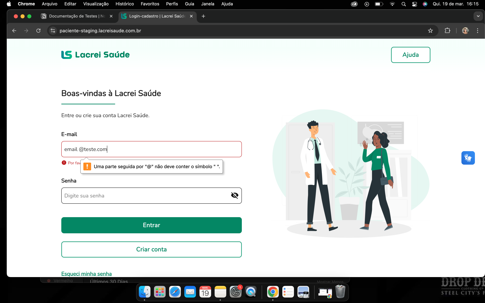

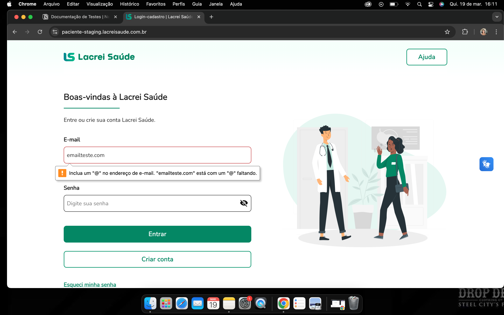

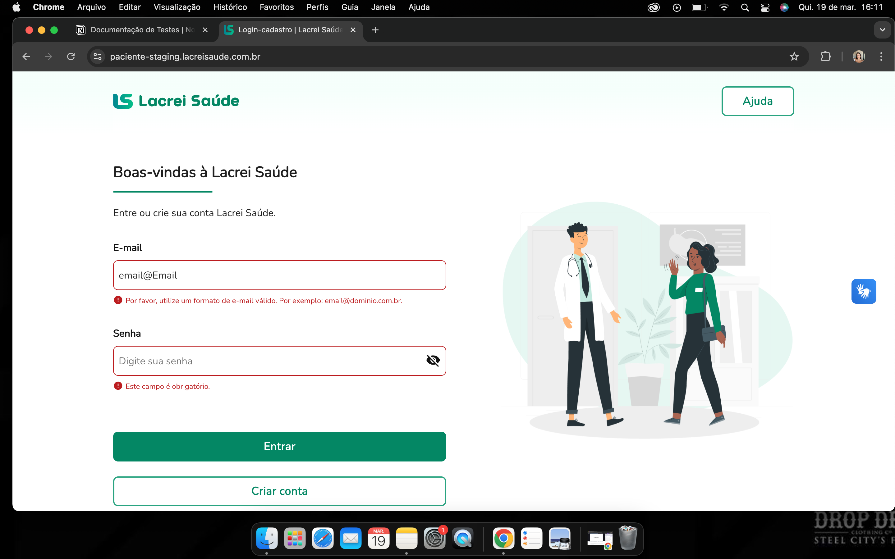

| Funcionalidade | Login - Validação de senha |
| --- | --- |
| Cenário | Login com senha inválida |
| Dado | Que o usuário esteja na tela de login |
| Quando | Ele insira uma senha inválida |
| E | Clicar em “Entrar” |
| Então | O sistema deve exibir mensagem de erro informando a senha inválida |
| Resultado obtido | O sistema apresenta a mensagem corretamente |
| Status | Passou |
| Variações testadas: | Senha incorreta
Campo senha vazio
Email válido + senha inválida
Apenas números
Apenas caracteres |

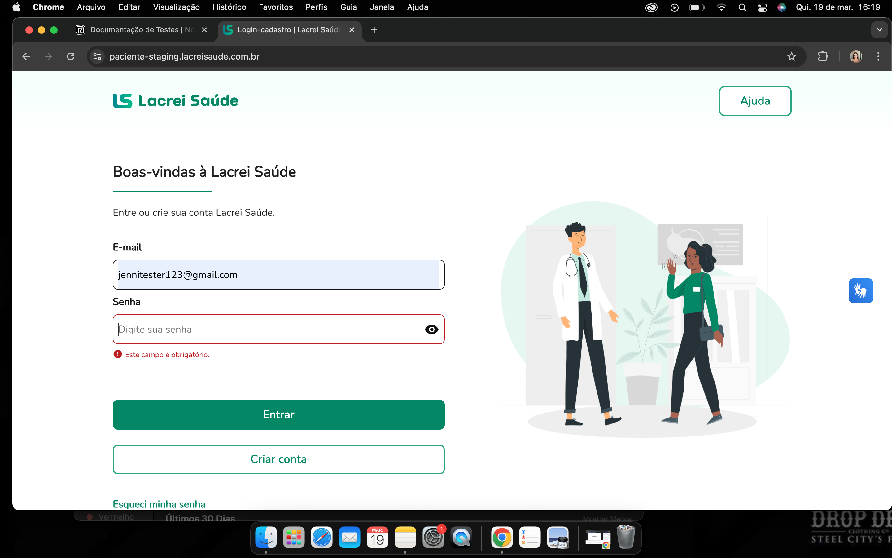

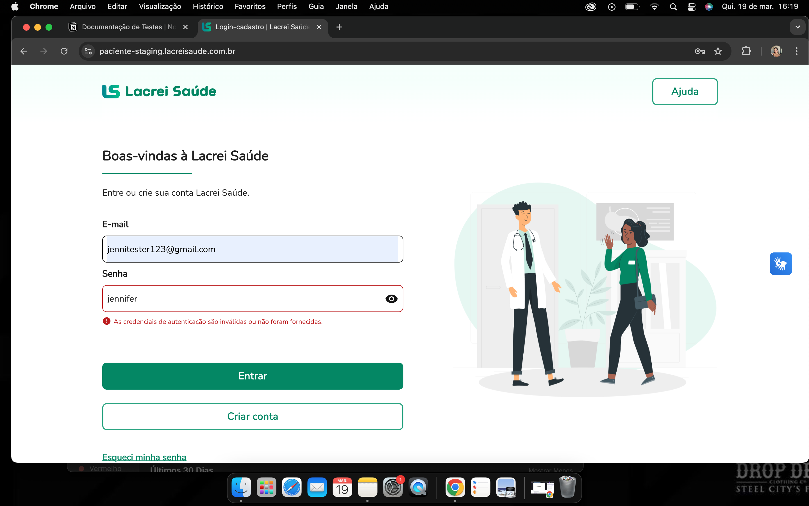

| Funcionalidade | Login  |
| --- | --- |
| Cenário | Múltiplos cliques no botão “Entrar” |
| Dado | Que o usuário esteja na tela de login  |
| Quando | Ele clica repetidamente no botão “Entrar” |
| Então | O sistema deve evitar múltiplas requisições de login simultâneas |
| Resultado obtido | O sistema processa apenas uma requisição por vez |
| Status | Passou |

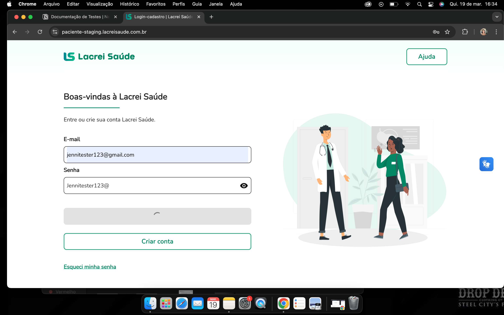

---

### **Registro de Teste de Desempenho**

| Funcionalidade | Performance de busca de profissionais |
| --- | --- |
| Cenário | Verificar o tempo de resposta em busca de profissionais |
| Dado | Que o usuário esteja logado na plataforma |
| Quando | O usuário acessar a busca por um profissional |
| E | Realizar um pesquisa |
| Então | O sistema deve retornar os resultados em tempo adequado para navegação do usuário |
| Resultado obtido | Performance: 45, teste indicou performance abaixo do ideal |
| Status | Reprovou |

**Resultado do teste**

Resultado obtido: Largest Contentful Paint: 6.8**s**
Speed Index: 4.3s
Ferramenta utilizada: Google Lighthouse

Observação: O tempo de carregamento apresentou valor acima do recomendado para o Largest Contentful Paint, podendo impactar a experiência do usuário na visualização dos resultados da busca.

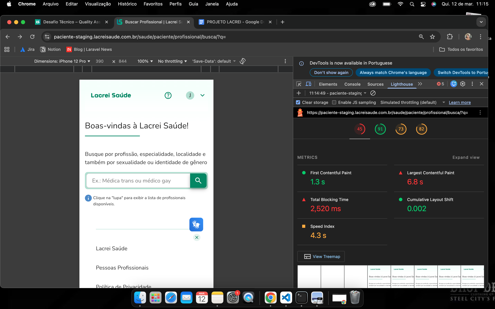

| Funcionalidade | Performance do sistema com múltiplos usuários |
| --- | --- |
| Cenário | Verificar comportamento do sistema com inúmeros acessos simultâneos |
| Dado | Que 30 usuários acessem a plataforma simultaneamente |
| Quando | Realizarem a busca por um profissional |
| Então | Então o sistema deve responder sem erros e com tempo de resposta inferior a 5 segundos |
| Resultado obtido | Teste não executado |

---

### **Registro de Teste de Acessibilidade**

- Navegação via teclado
- Leitor de tela VoiceOver
- Contraste de cores e legibilidade

| Funcionalidade | Navegação via teclado |
| --- | --- |
| Cenário | Usuário navega no site utilizando apenas o teclado |
| Dado | Que o usuário esteja navegando no site |
| Quando | Ele utilizar a tecla Tab para navegar pelos elementos da página |
| Então | O sistema deve permitir acessar links, botões e campos de formulário utilizando apenas o teclado |
| Resultado obtido | Foi possível navegar entre links, botões e campos de formulário utilizando a tecla Tab. |
| Status | Passou |

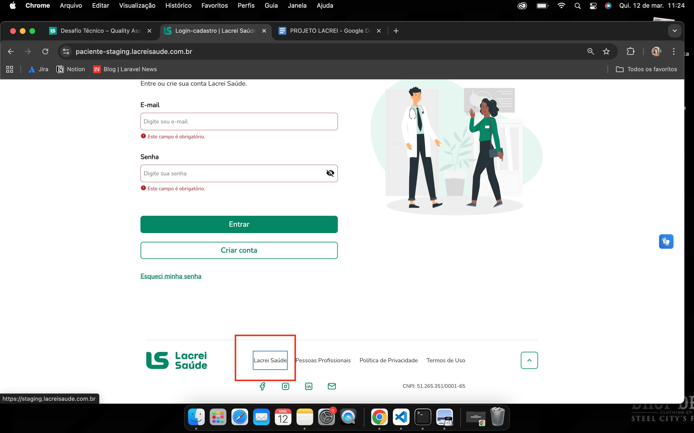

| Funcionalidade | Acessibilidade com leitor de tela |
| --- | --- |
| Cenário | Usuário navega o site utilizando o Voiceover |
| Dado | Que o usuário esteja navegando no site |
| Quando | Ele utilizar o leitor de tela VoiceOver |
| Então | Os elementos da interface devem ser identificados corretamente pelo leitor de tela |
| Resultado obtido | Os principais elementos da interface, como links, botões e campos de formulário, foram identificados corretamente pelo leitor de tela. |
| Status | Passou |

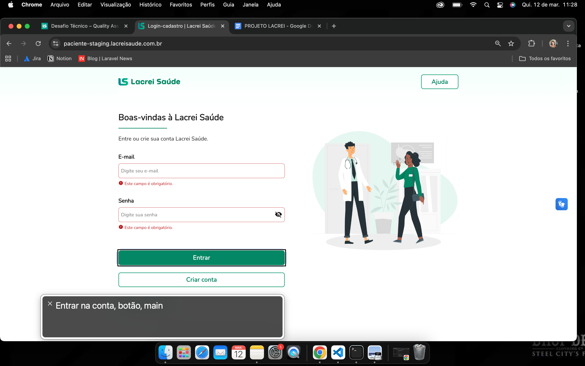

| Funcionalidade | Contraste de cores e legibilidade |
| --- | --- |
| Cenário | Validação do contraste de cores da página |
| Dado | Que o usuário esteja navegando no site |
| Quando | A página for analisada pela ferramenta de acessibilidade |
| Então | A pontuação de acessibilidade deve ser igual ou superior a 90 no Google Lighthouse |
| Resultado obtido | A análise realizada apresentou pontuação de acessibilidade 96, indicando que o contraste de cores e a legibilidade atendem aos critérios avaliados. |
| Status | Passou |

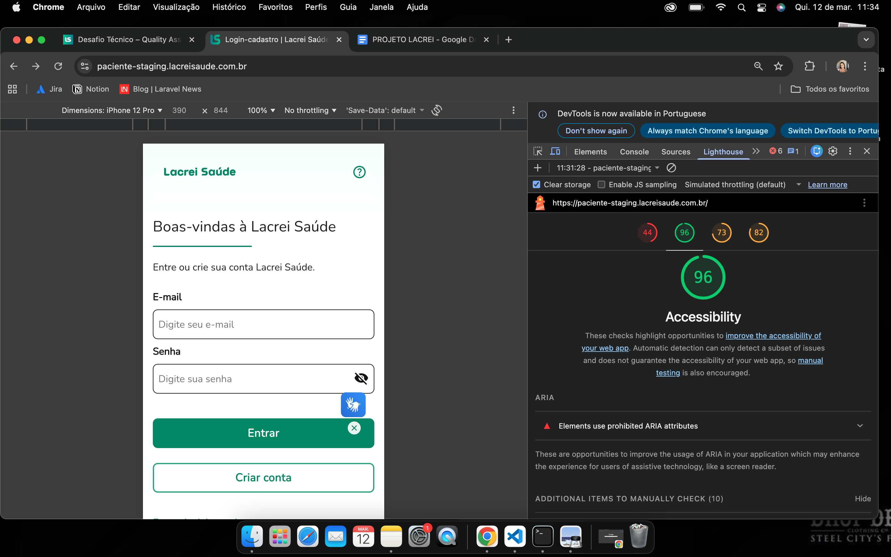

**Insight de acessibilidade:** Durante o teste com o leitor de tela VoiceOver, foi observado que alguns elementos da interface são anunciados apenas como "grupo", sem uma descrição clara de seu propósito. Isso pode gerar confusão para usuários que dependem de leitores de tela para navegação.

**Sugestão de melhoria:** Algo que possa permitir que o leitor de tela comunique melhor a função desses elementos.

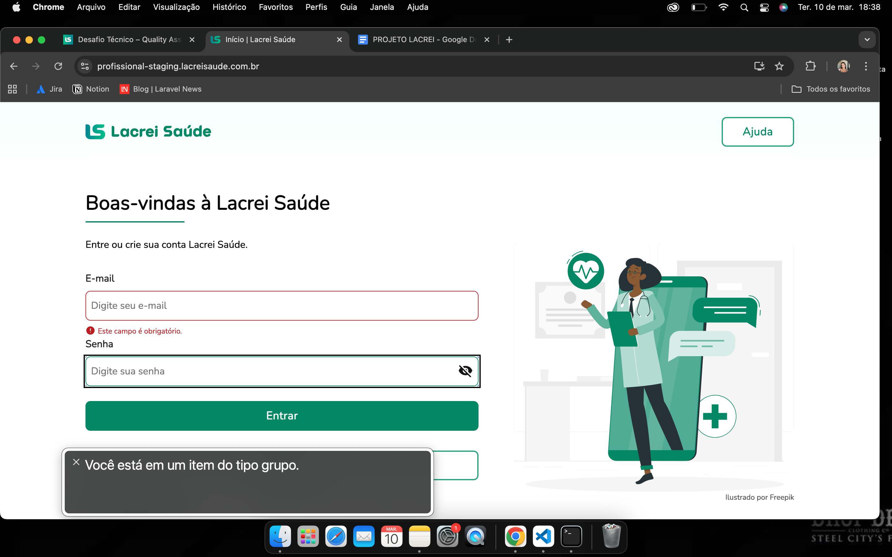

---

### **Registro de Teste de Responsividade**

| Funcionalidade | Responsividade em dispositivos mobile |
| --- | --- |
| Cenário | Validar exibição da interface em telas mobiles |
| Dado | Que o usuário acessa o site em um dispositivo mobile com largura de tela até 600px |
| Quando | A página é carregada no dispositivo |
| Então | Os elementos da interface devem estar ajustados corretamente, o conteúdo deve permanecer legível, os botões e links devem ser acessíveis |
| Resultado obtido | Os principais elementos da interface, como links, botões e campos de formulário, estavam ajustados corretamente. |
| Status | Passou |

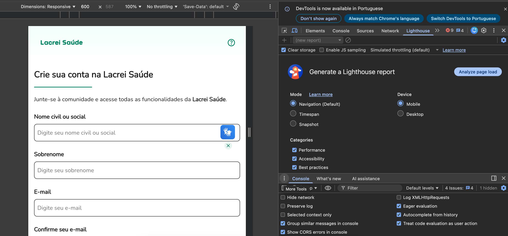

| Funcionalidade | Responsividade em dispositivos desktop |
| --- | --- |
| Cenário | Validar exibição da interface em telas desktop |
| Dado | Que o usuário acessa o site em um dispositivo desktop com largura de tela superior a 1024px |
| Quando | A página é carregada no dispositivo |
| Então | O layout deve ser exibido corretamente, os elementos devem permanecer alinhados e o conteúdo visível |
| Resultado obtido | Os principais elementos da interface, como links, botões e campos de formulário, estavam ajustados corretamente. |
| Status | Passou |

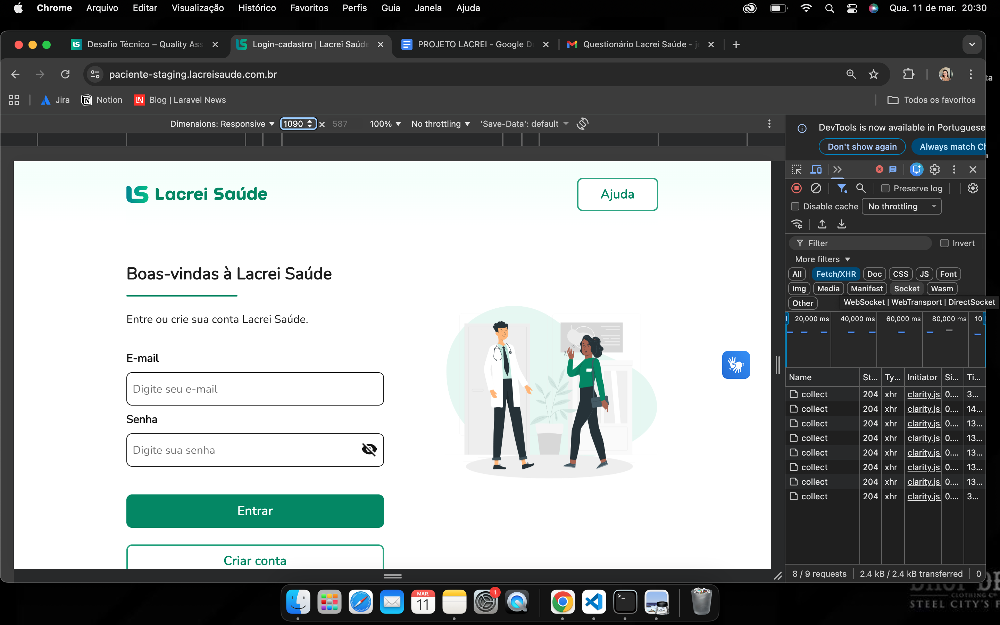

| Funcionalidade | Página do perfil (mobile e desktop) |
| --- | --- |
| Cenário | Validação de layout, funcionalidade e usabilidade da página do perfil |
| Dado | Que o usuário esteja na página do perfil |
| Quando | Ele tentar editar os dados do perfil |
| Então | Os elementos da interface devem estar alinhados e visíveis corretamente, permitindo a edição dos dados do perfil |
| Resultado obtido | Foram identificados problemas na interface: botões desalinhados e ausência de campos com os dados do usuário para edição, impossibilitando a atualização das informações. |
| Status | Reprovou - Bug reportado BR07 |
|  | 🔗 🎥 [LINK DE EVIDENCIA DOO BUG REPORTADO EM VIDEO](https://www.loom.com/share/c1e05d7df8d44bdb9fa87fc13d8f01fa) |

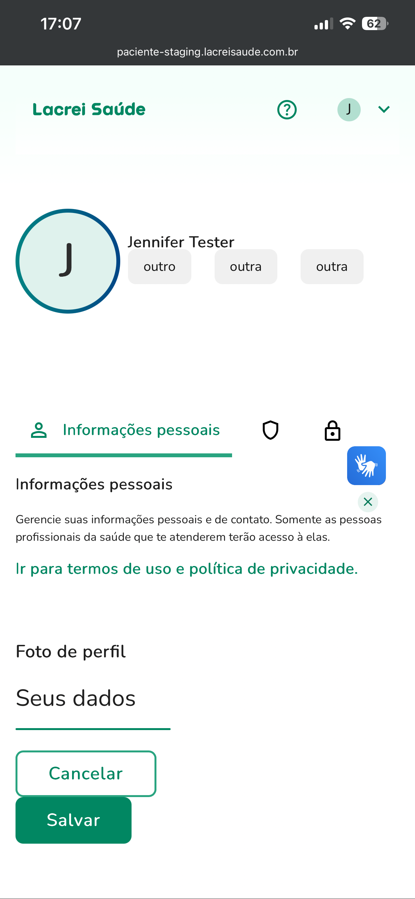

---

### **Relatório de bugs**

| BUG REPORT | BR01 |
| --- | --- |
| Descrição | O formulário de cadastro exibe a mensagem de erro “Os e-mails não correspondem, digite novamente.” no campo de e-mail mesmo quando o valor inserido é igual ao campo confirmar e-mail |
| Passos | 1. Acessar página de cadastro
2. Preencher os campos obrigatórios
3. No campo email inserir [jennitester123@gmail.com](mailto:jennitester123@gmail.com)”
4. No campo confirmar email inserir “[jennitester123@gmail.com](mailto:jennitester123@gmail.com)”
5. Clicar no botão “Cadastrar” |
| Impacto | Dificulta o entendimento e experiência do usuário  |
| Prioridade | Média |

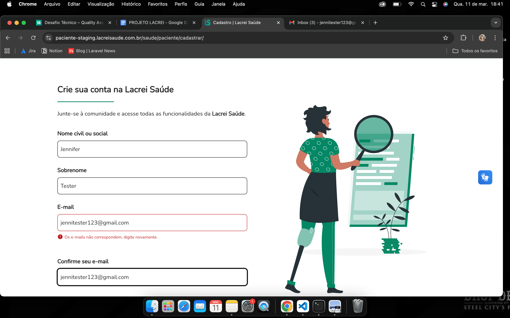

| BUG REPORT | BR02 |
| --- | --- |
| Descrição | Ao contatar o profissional o campo de validação do código exibe a mensagem de erro “Falha na comunicação com o servidor, por favor tente novamente mais tarde.”  mesmo quando o código é válido. |
| Passos | 1. Acessar página com login e senha
2. Acessar busca por profissionais
3. Clicar em buscar
4. Selecionar um profissional
5. Clicar em agendar consulta
6. Digitar o celular para prosseguir com agendamento
7. Clicar em enviar código
8. Digitar o código recebido por sms
9. Clicar em “Confirmar” |
| Impacto | Impede o agendamento de contato com o profissional com a instabilidade no sistema. |
| Prioridade | Alta |

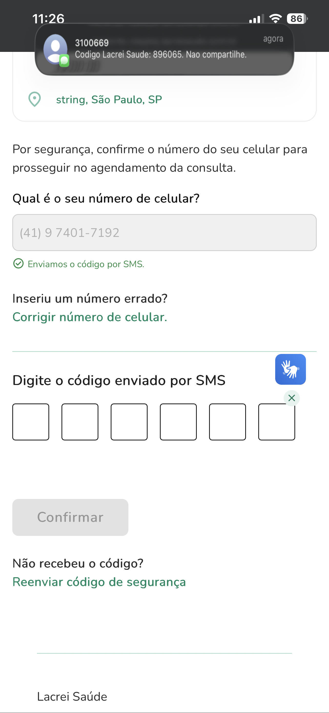

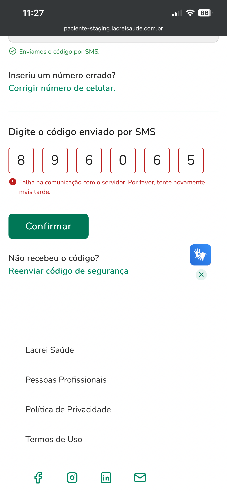

| BUG REPORT | BR03 |
| --- | --- |
| Descrição | Ao clicar na opção “Esqueci minha senha”, o sistema redireciona para a página de recuperação de senha. Porém, a página atualiza automaticamente em poucos segundos e retorna para a tela de login, impedindo que o usuário digite o e-mail para recuperação. |
| Passos | 1. Acessar a página de login.
2. Clicar na opção “Esqueci minha senha”.
3. Aguardar o redirecionamento para a página de recuperação de senha. |
| Impacto | Impede a recuperação de senha do usuário e acesso ao site. |
| Prioridade | Alta |
|  | 🔗 🎥 [LINK DE EVIDENCIA DO BUG REPORTADO EM VIDEO](https://www.loom.com/share/7d76bd533f874affa0bc76f67fc7b0e7) |

| BUG REPORT | BR04 |
| --- | --- |
| Descrição | Ao contatar um profissional, ao clicar na opção “Agendar consulta”, nenhuma ação acontece, impedindo que o usuário consiga realizar agendamento. |
| Passos | 1. Acessar página com login e senha
2. Acessar busca por profissionais
3. Clicar em Buscar
4. Selecionar um profissional
5. Clicar em Agendar consulta
6. Digitar o celular para prosseguir com agendamento
7. Clicar em Enviar código
8. Digitar o codigo recebido por sms
9. Clicar em “Confirmar”
10. Clicar em “Agendar consulta” |
| Impacto | Impede o contato com o profissional |
| Prioridade | Alta |
|  | 🔗 🎥 [LINK DE EVIDENCIA DO BUG REPORTADO EM VIDEO](https://www.loom.com/share/1675e82433174e37bd9f30982b5b1832) |

| BUG REPORT | BR05 |
| --- | --- |
| Descrição | No questionário de pós cadastro sobre deficiências, a opção  “Outra”, ao ser selecionada, não permite avançar para a conclusão do cadastro. |
| Passos | 1. Criar cadastro
2. Ativar conta
3. Efetuar login e senha
4. Continuar cadastro
5. Responder o questionário
6. Na questão "Você possui alguma deficiência”
7. Clicar em “Outra”
8. Clicar em "Próximo” |
| Impacto | O botão "próximo” não executa nenhuma ação e impede a finalização do cadastro |
| Prioridade | Alta |
|  | 🔗 🎥 [LINK DE EVIDENCIA DO BUG REPORTADO EM VIDEO](https://www.loom.com/share/ded7effd08ec4d8f8b3ef6fb2cb4150b) |

| BUG REPORT | BR06 |
| --- | --- |
| Descrição | Na página de questionário de pós cadastro sobre deficiências, a opção “Outra” não apresenta campo para digitar a deficiência. |
| Passos | 1. Criar cadastro
2. Ativar conta
3. Efetuar login e senha
4. Continuar cadastro
5. Responder o questionário
6. Na questão "Você possui alguma deficiência”
7. Clicar em “Outra” |
| Impacto | Impede que o usuário informe outra deficiência não listada nas opções. |
| Prioridade | Alta |

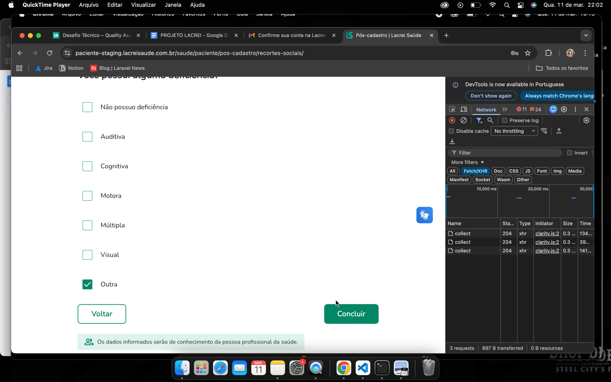

| BUG REPORT | BR07 |
| --- | --- |
| Descrição | Na página de perfil do usuário, ao acessar a opção de editar dados, os campos com as informações do usuário não são exibidos, impossibilitando a atualização das informações. |
| Passos | 1.Acessar página de login e senha
2.Realizar login na plataforma
3.Clicar no ícone do "Perfil”
4.Clicar em “Editar dados” |
| Impacto | Impede que o usuário atualize suas informações de perfil mobile e desktop. |
| Prioridade | Alta |
|  | 🔗 🎥 [LINK DE EVIDENCIA DO BUG REPORTADO EM VIDEO](https://www.loom.com/share/c1e05d7df8d44bdb9fa87fc13d8f01fa) |

